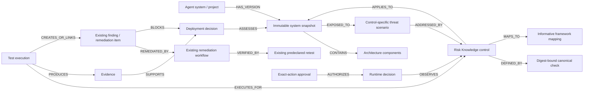

# AgentRiskLayer Control Intelligence Graph

## Purpose and scope

Control Intelligence is a versioned relational evidence model and derived graph API. It connects the assessed agent state to applicable ARL-RKA-1.2.0 controls, canonical test definitions, executions, evidence, findings, runtime decisions, exact-action approvals, remediation, retesting and deployment decisions.

It is not a second database, graph database, certification system or arbitrary node store. PostgreSQL remains production truth; the supported SQLite adapter executes the same additive schema for local tests.

> AgentRiskLayer Security Assessment — assessed against AgentRiskLayer Control Profile ARL-RKA-1.2.0.

> This proprietary assessment is not an accredited certification or a guarantee that the system is risk-free.

## Relationship model



Graph nodes and edges are safe serializers over explicit domain records. An edge is returned only when both authorized endpoints are present in the bounded response.

## Existing records reused

- Projects, workspaces and memberships provide agent identity, tenancy and roles.
- Risk Knowledge entries, checks, mappings and validation records provide controls, executable test prose, versions, digests and candidate lifecycle.
- Project Risk Knowledge states/context provide applicability, evidence state and contextual severity.
- Risk Knowledge links connect controls to existing assessment, runtime, approval, remediation, retest and evidence subjects.
- Runtime events provide privacy-safe Guard decisions, policy identity, action/argument digests and retest results.
- Runtime approvals retain exact-action, project, environment, expiry and one-time consumption bindings.
- Remediation items, evidence artifacts and predeclared criteria retain findings, implementation evidence and retesting.
- The security audit log records accountable mutations.

## Additive schema

Migration `015_control_intelligence_graph.sql` adds `system_snapshots`, `control_snapshot_evaluations`, `control_test_executions`, `control_evidence_items`, `control_deployment_decisions`, `deployment_decision_evidence` and `control_snapshot_runtime_bindings`. The last table binds runtime decisions and exact-action approvals to the system snapshot current at creation. It adds only tables and indexes. There is no destructive update, delete, truncate, table replacement or second persistence system.

The hardened migration also adds narrowly scoped `control_finding_bindings`, `control_approval_requirements`, `runtime_control_mappings`, and `control_integrity_audit_dedup` records. Legacy findings, approvals and runtime events remain available as history but cannot qualify for a current control unless a server-authorized, digest-bound snapshot/control relationship exists.

## System snapshots and staleness

The server canonicalizes a bounded structure containing architecture, models, tools/MCP servers, identities, data sources, network access, autonomy, approval configuration, current runtime-policy identity and assessment configuration. SHA-256 is calculated server-side over canonical JSON. Client digests and sensitive fields are rejected.

Submitting identical material state returns the existing snapshot. A material change creates a new immutable version, supersedes the previous snapshot, marks its control evaluations stale and marks current deployment decisions stale with `material_system_snapshot_change`. Prior evidence, findings and decisions remain historical. New evidence, tests or decisions cannot attach to a superseded snapshot.

SHA-256 binds versions and detects inconsistent records; it does not prove author identity or make storage tamper-proof.

Snapshot creation is serialized by locking the authorized `security_projects` row inside the transaction on PostgreSQL; SQLite uses its adapter's immediate write transaction. A partial unique index independently enforces one `current` snapshot per project. The API accepts `expectedCurrentSnapshotId` as a compare-and-swap guard: a stale editor receives `409` and must reload. Identical concurrent submissions converge on the project/digest unique record; different submissions serialize, preserve history and leave exactly one current version.

Evaluations, executions, evidence, runtime bindings and deployment evidence use composite scope keys so a relationship cannot change workspace, project, snapshot or control. Legacy finding/remediation/runtime/approval records are admitted only through the shared server-side scope checks; a project match alone is insufficient.

Canonical descriptors include normalized security-relevant fields, provenance IDs, actor, timestamps, verification, sensitivity and retention state. Reads used by the graph or deployment derivation rebuild that canonical representation from normalized columns and compare it with both the stored descriptor and server digest. A mismatch fails closed with `CONTROL_INTELLIGENCE_INTEGRITY_FAILURE`, does not qualify as evidence, and prevents a proceed decision without exposing raw content.

## Evidence and chain semantics

Evidence classes are `declared`, `observed`, `test_generated`, `runtime`, `human_provided` and `imported`. Declaration remains `declared`; a reference remains `unverified`; only an existing project-bound and snapshot-bound runtime event or approval, or a project-bound remediation artifact, is serialized as `verified`. Descriptors contain privacy-safe references and digests, not raw prompts, tool payloads, secrets or API keys.

Chain status is derived server-side. Current states are `context_required`, `not_applicable`, `applicable_unassessed`, `test_planned`, `finding_open`, `remediation_in_progress`, `controlled_with_evidence`, `runtime_regression` and `reassessment_required`. Responses list completed and missing stages. Missing evidence is never inferred, declared evidence is not observed evidence, and context-required severity is never Low.

## Deployment decisions

Only project admins and owners can record a decision. The caller supplies rationale and the exact current snapshot; the server derives `proceed`, `hold` or `do_not_deploy`.

- Unknown architecture, unevaluated applicable controls, missing verified evidence, open findings, failed tests or incomplete retesting produce `hold`.
- An open evaluated Critical snapshot-bound finding produces `do_not_deploy`.
- `proceed` requires current applicability, current verified evidence for applicable controls and no open blocker. It remains accountable decision support, not automatic deployment authorization.
- Material changes stale prior decisions; old decisions cannot authorize a new snapshot.
- A partial unique index permits one current decision for a project/snapshot. Recording locks the project, checks `expectedCurrentDecisionId`, re-derives within the transaction, preserves the prior immutable decision as stale, and inserts the successor atomically.
- Required approvals come only from the snapshot's explicit server-bound action requirements. They must be current-snapshot, control-bound, active, unexpired and unconsumed. Historical project links never complete the current approval stage.
- Exact requirements use `approvalConfiguration.requiredActions`. The canonical requirement binds action, full parameters, target, value/amount, currency/unit, requesting actor where specified, control, snapshot, policy version/digest, reuse scope and requirement digest. A generic approval row or caller-supplied digest never qualifies. Parameter, target, amount, currency, policy, snapshot or control substitution fails closed.
- A retest is distinct from an ordinary pass. It binds the original failed execution, finding/remediation, vulnerable snapshot and different remediated snapshot. Missing or mismatched provenance remains a hold.

## Runtime attribution and integrity audit

Ordinary runtime events are not assigned from a caller-provided control ID. A snapshot may contain versioned `runtimeControlMappings` from server-owned Guard rule IDs and the published policy version/digest to a Risk Knowledge control. Runtime insertion resolves the server-generated decision reasons against that mapping inside the existing transaction. Missing or stale mappings leave the event unbound and therefore unable to support deployment.

Digest verification covers snapshots, evaluations, executions, evidence, runtime/approval bindings and decisions. A mismatch fails the read or decision closed and attempts a safe `control_intelligence.integrity_failure` audit event. The event contains record type/ID and tenant/snapshot/control scope, never the descriptor or private payload. A digest fingerprint deduplicates repeated reads while retaining an occurrence counter. Audit-write failure is emitted as a structured server error and never converts the failed record into acceptable evidence.

## Report integration

Existing customer assessment reports include Control Intelligence only when an assessment is explicitly linked to the project through its existing finding/remediation relationship. The section records exact snapshot and control-profile digests, scope/exclusions, applicable and unevaluated controls, observed evidence, missing evidence, open findings, runtime/approval evidence and the current decision. Projects without graph records continue to use the existing report. The report retains the required proprietary-assessment and non-certification wording.

## Authorization, privacy and performance

Existing roles are reused: viewers may read; analysts/developers/admins/owners may record tests/evidence; developers/admins/owners may create snapshots; admins/owners may record deployment decisions and use the existing exact-action approval flow.

Every query includes authorized project/workspace boundaries. Mutations reject caller-supplied workspace, user, digest, severity, verification, chain and deployment fields. Responses use `private, no-store`. Public Risk Library serializers remain project-data-free.

Summary responses page controls with a maximum of 50. Evidence/runtime/approval/remediation queries are bounded and fetched in sets. Detail history is capped at 50. There is no recursive traversal or arbitrary graph query.

## UX, rollback and limitations

One primary Control Intelligence entry opens Overview, Controls, Evidence chain and Deployment decision. A readable chain/list is the default and the node/relationship view has a keyboard-readable text alternative. Mobile layout collapses to one column.

Application rollback may stop exposing routes/UI while retaining migration 015 tables. Dropping them is not the default because it destroys locally recorded graph evidence; use a verified backup for physical rollback.

### Disposable PostgreSQL verification

PostgreSQL evidence must use a dedicated destructive-test URL, never `DATABASE_URL`. The supported invocation is:

```bash
TEST_DATABASE_URL='postgresql://.../arl_disposable_test' DATABASE_URL='' NODE_ENV=test npm test
```

The `scripts/test-control-intelligence-postgres.mjs` harness rejects equality with `DATABASE_URL`, non-loopback and production-like targets, and database names without an explicit test/disposable marker. It applies migrations 001–016, verifies checksum-idempotent restart, exercises independent transaction concurrency and malformed relational writes, and removes only the disposable database schema. Static parsing or SQLite is not equivalent evidence.

Limitations: pre-015 evidence has no exact snapshot binding and is not promoted into current evidence; project-bound inspection/red-team detail depends on existing resolvers; severity editing remains deferred and client severity is rejected; cross-customer analytics are excluded pending privacy/consent design; framework mappings remain informative and do not establish compliance.

## Guided customer journey (10.1.1)

Migration `016_control_intelligence_journey.sql` adds immutable applicability revisions without changing deployed migration 015. Each revision is bound to the workspace, project, snapshot, control profile, control digest, server-resolved evaluator and supporting architecture facts. The current evaluation remains the efficient project view; revision history preserves prior decisions and an optimistic-concurrency digest.

The server derives the progressive applicability, test, evidence, conditional finding/remediation/retest, conditional approval and project-decision stages. Structured snapshot facts are customer declarations, not observed evidence. Suggestions require customer confirmation and are not automatic applicability decisions. Referenced evidence remains unverified unless an existing trusted collector or integrity-bound source verifies it. Application rollback may leave both additive migrations 015 and 016 present; rollback must not delete customer evidence.

The project control workspace exposes the remaining evidence-chain actions through ordinary forms: observed evidence, finding creation, remediation planning, implementation evidence, remediated snapshots, exact retests, authorised closure, exact-action approval and project deployment review. Closure is server-derived and requires a digest-valid passed exact retest on the current remediated snapshot, verified retest evidence and active implementation evidence. The client cannot supply reviewer identity, severity, verification state, digests or deployment outcome.

Failed tests are saved before a finding exists. The customer must review and submit the separate finding form; the server then binds the finding to the failed execution and derives project-contextual severity from asserted impact facts. The visible **Generate assessment report** action opens the authenticated, `private, no-store` project report after a deployment decision has been derived. The report preserves snapshot/profile identity, applicability reasons, evidence state, finding and retest status, approval evidence, decision limitations and the proprietary non-certification wording.

The release browser validator advances the journey only by focusing, typing into and activating visible controls. Its source guard rejects direct application API mutation, database access, browser-storage forgery and internal service invocation. Customer-submitted evidence remains unverified unless an authorised server workflow establishes verification.

### Architecture suggestions and bulk review

Suggestion Profile `ARL-SUGGEST-1.0.0` is a server-owned deterministic mapping over structured snapshot facts and canonical Risk Knowledge metadata. Its SHA-256 digest binds the version, supported fact keys, ordered rules, priorities and rationale templates. The same snapshot and catalogue version produce the same ordered suggestions. Every structured fact has a deterministic rule; every active control remains reachable through a strong match, possible-relevance result or manual-review fallback. Suggestions do not modify applicability and are not observed evidence.

The overview permits at most 20 selected controls per bulk review. Each row requires its own decision, specific reason and confirmed fact references; `context_required` also records missing information. A project-scoped transaction authorizes the current snapshot, validates every row, inserts one immutable revision per control, updates current evaluations and writes a bounded audit event. Duplicate or unknown controls, unconfirmed facts, stale snapshot/evaluation digests and caller-owned identity or risk fields reject and roll back the complete batch. Previous revisions remain reportable history.
