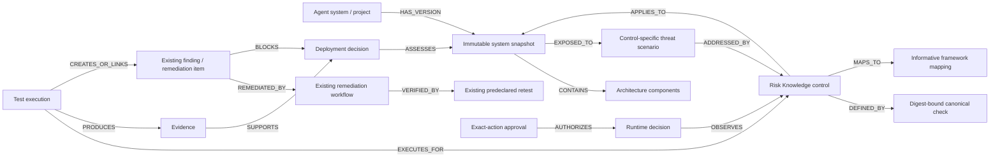

# AgentRiskLayer Control Intelligence Graph

## Purpose and scope

Control Intelligence is a versioned relational evidence model and derived graph API. It connects the assessed agent state to applicable ARL-RKA-1.2.0 controls, canonical test definitions, executions, evidence, findings, runtime decisions, exact-action approvals, remediation, retesting and deployment decisions.

It is not a second database, graph database, certification system or arbitrary node store. PostgreSQL remains production truth; the supported SQLite adapter executes the same additive schema for local tests.

> AgentRiskLayer Security Assessment — assessed against AgentRiskLayer Control Profile ARL-RKA-1.2.0.

> This proprietary assessment is not an accredited certification or a guarantee that the system is risk-free.

## Relationship model



Graph nodes and edges are safe serializers over explicit domain records. An edge is returned only when both authorized endpoints are present in the bounded response.

## Existing records reused

- Projects, workspaces and memberships provide agent identity, tenancy and roles.
- Risk Knowledge entries, checks, mappings and validation records provide controls, executable test prose, versions, digests and candidate lifecycle.
- Project Risk Knowledge states/context provide applicability, evidence state and contextual severity.
- Risk Knowledge links connect controls to existing assessment, runtime, approval, remediation, retest and evidence subjects.
- Runtime events provide privacy-safe Guard decisions, policy identity, action/argument digests and retest results.
- Runtime approvals retain exact-action, project, environment, expiry and one-time consumption bindings.
- Remediation items, evidence artifacts and predeclared criteria retain findings, implementation evidence and retesting.
- The security audit log records accountable mutations.

## Additive schema

Migration `015_control_intelligence_graph.sql` adds `system_snapshots`, `control_snapshot_evaluations`, `control_test_executions`, `control_evidence_items`, `control_deployment_decisions`, `deployment_decision_evidence` and `control_snapshot_runtime_bindings`. The last table binds runtime decisions and exact-action approvals to the system snapshot current at creation. It adds only tables and indexes. There is no destructive update, delete, truncate, table replacement or second persistence system.

## System snapshots and staleness

The server canonicalizes a bounded structure containing architecture, models, tools/MCP servers, identities, data sources, network access, autonomy, approval configuration, current runtime-policy identity and assessment configuration. SHA-256 is calculated server-side over canonical JSON. Client digests and sensitive fields are rejected.

Submitting identical material state returns the existing snapshot. A material change creates a new immutable version, supersedes the previous snapshot, marks its control evaluations stale and marks current deployment decisions stale with `material_system_snapshot_change`. Prior evidence, findings and decisions remain historical. New evidence, tests or decisions cannot attach to a superseded snapshot.

SHA-256 binds versions and detects inconsistent records; it does not prove author identity or make storage tamper-proof.

Snapshot creation is serialized by locking the authorized `security_projects` row inside the transaction on PostgreSQL; SQLite uses its adapter's immediate write transaction. A partial unique index independently enforces one `current` snapshot per project. The API accepts `expectedCurrentSnapshotId` as a compare-and-swap guard: a stale editor receives `409` and must reload. Identical concurrent submissions converge on the project/digest unique record; different submissions serialize, preserve history and leave exactly one current version.

Evaluations, executions, evidence, runtime bindings and deployment evidence use composite scope keys so a relationship cannot change workspace, project, snapshot or control. Legacy finding/remediation/runtime/approval records are admitted only through the shared server-side scope checks; a project match alone is insufficient.

Canonical descriptors include normalized security-relevant fields, provenance IDs, actor, timestamps, verification, sensitivity and retention state. Reads used by the graph or deployment derivation rebuild that canonical representation from normalized columns and compare it with both the stored descriptor and server digest. A mismatch fails closed with `CONTROL_INTELLIGENCE_INTEGRITY_FAILURE`, does not qualify as evidence, and prevents a proceed decision without exposing raw content.

## Evidence and chain semantics

Evidence classes are `declared`, `observed`, `test_generated`, `runtime`, `human_provided` and `imported`. Declaration remains `declared`; a reference remains `unverified`; only an existing project-bound and snapshot-bound runtime event or approval, or a project-bound remediation artifact, is serialized as `verified`. Descriptors contain privacy-safe references and digests, not raw prompts, tool payloads, secrets or API keys.

Chain status is derived server-side. Current states are `context_required`, `not_applicable`, `applicable_unassessed`, `test_planned`, `finding_open`, `remediation_in_progress`, `controlled_with_evidence`, `runtime_regression` and `reassessment_required`. Responses list completed and missing stages. Missing evidence is never inferred, declared evidence is not observed evidence, and context-required severity is never Low.

## Deployment decisions

Only project admins and owners can record a decision. The caller supplies rationale and the exact current snapshot; the server derives `proceed`, `hold` or `do_not_deploy`.

- Unknown architecture, unevaluated applicable controls, missing verified evidence, open findings, failed tests or incomplete retesting produce `hold`.
- An open evaluated Critical snapshot-bound finding produces `do_not_deploy`.
- `proceed` requires current applicability, current verified evidence for applicable controls and no open blocker. It remains accountable decision support, not automatic deployment authorization.
- Material changes stale prior decisions; old decisions cannot authorize a new snapshot.
- A partial unique index permits one current decision for a project/snapshot. Recording locks the project, checks `expectedCurrentDecisionId`, re-derives within the transaction, preserves the prior immutable decision as stale, and inserts the successor atomically.
- Required approvals come only from the snapshot's explicit `approvalConfiguration.requiredControlIds`. They must be current-snapshot, control-bound, active, unexpired and unconsumed. Historical project links never complete the current approval stage.
- A retest is distinct from an ordinary pass. It binds the original failed execution, finding/remediation, vulnerable snapshot and different remediated snapshot. Missing or mismatched provenance remains a hold.

## Authorization, privacy and performance

Existing roles are reused: viewers may read; analysts/developers/admins/owners may record tests/evidence; developers/admins/owners may create snapshots; admins/owners may record deployment decisions and use the existing exact-action approval flow.

Every query includes authorized project/workspace boundaries. Mutations reject caller-supplied workspace, user, digest, severity, verification, chain and deployment fields. Responses use `private, no-store`. Public Risk Library serializers remain project-data-free.

Summary responses page controls with a maximum of 50. Evidence/runtime/approval/remediation queries are bounded and fetched in sets. Detail history is capped at 50. There is no recursive traversal or arbitrary graph query.

## UX, rollback and limitations

One primary Control Intelligence entry opens Overview, Controls, Evidence chain and Deployment decision. A readable chain/list is the default and the node/relationship view has a keyboard-readable text alternative. Mobile layout collapses to one column.

Application rollback may stop exposing routes/UI while retaining migration 015 tables. Dropping them is not the default because it destroys locally recorded graph evidence; use a verified backup for physical rollback.

### Disposable PostgreSQL verification

PostgreSQL evidence must use a dedicated destructive-test URL, never `DATABASE_URL`. The supported invocation is:

```bash
TEST_DATABASE_URL='postgresql://.../arl_disposable_test' DATABASE_URL='' NODE_ENV=test npm test
```

The test harness must reject equality with `DATABASE_URL` and obvious production targets, create an isolated test schema, apply migrations 001–015, use separate connections for concurrency, and remove only that verified schema. Static parsing or SQLite is not equivalent evidence.

Limitations: pre-015 evidence has no exact snapshot binding and is not promoted into current evidence; project-bound inspection/red-team detail depends on existing resolvers; severity editing remains deferred and client severity is rejected; cross-customer analytics are excluded pending privacy/consent design; framework mappings remain informative and do not establish compliance.
